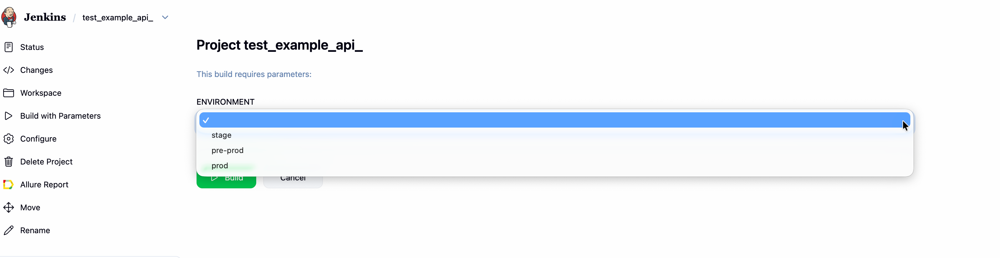
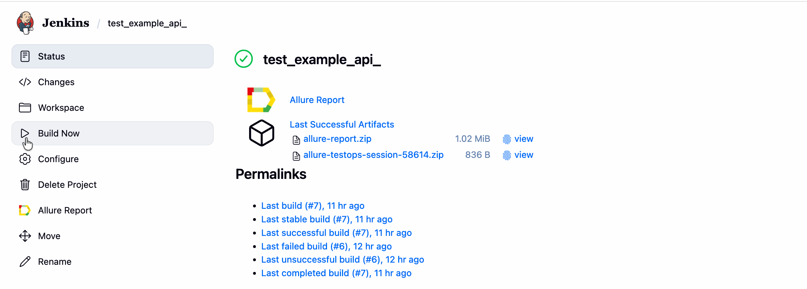
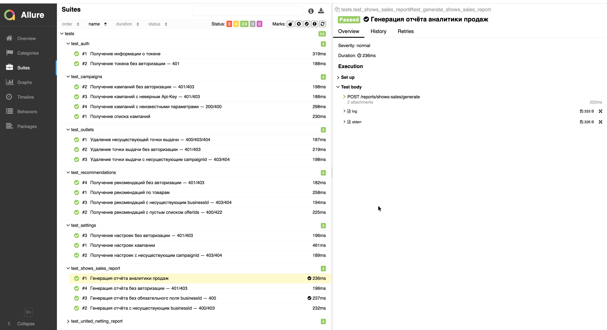
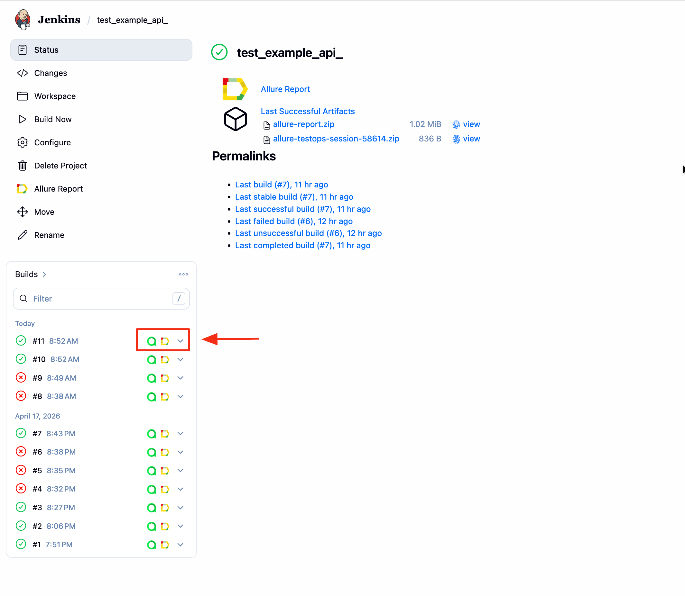
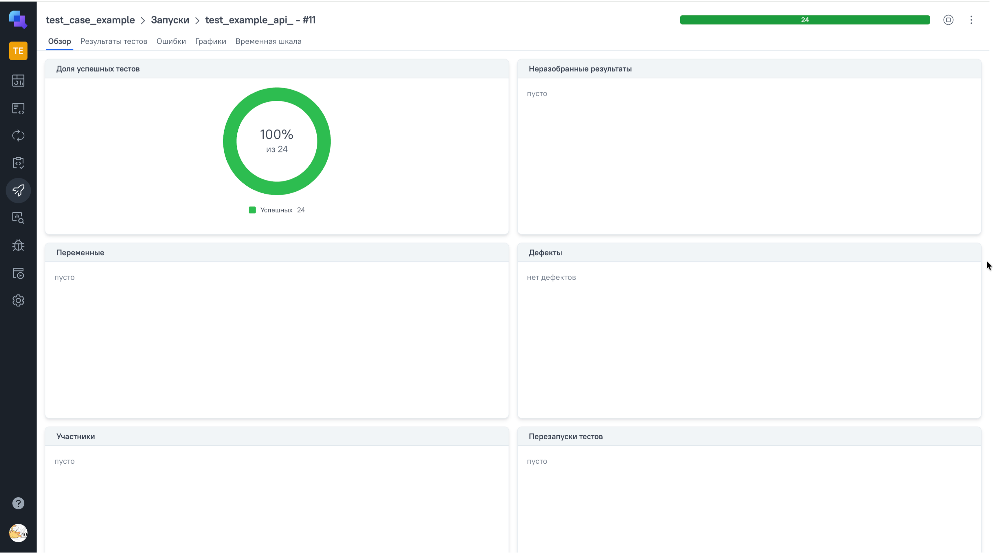
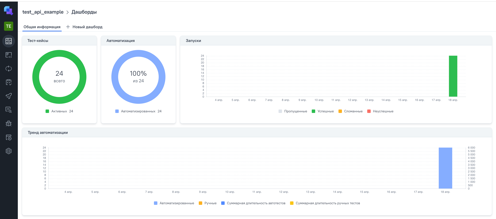
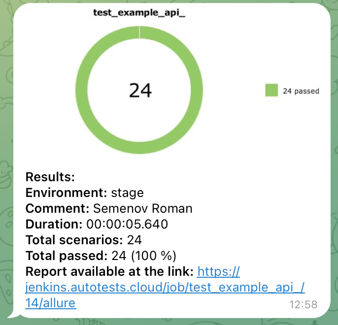

# Автоматизация тестирования API Яндекс Маркета

Проект покрывает автоматизированное тестирование REST API личного кабинета продавца на [Яндекс Маркете](https://partner.market.yandex.ru/).

Документация: https://yandex.ru/dev/market/partner-api/doc/ru/

---

## Технологии

<p align="center">
  
  
  
  
  
  
  
  
  
</p>

| Технология | Назначение |
|---|---|
| Python 3 | Язык программирования |
| pytest | Фреймворк для тестирования |
| requests | HTTP-клиент для API-запросов |
| jsonschema | Валидация схем ответов |
| Allure | Отчёты о прохождении тестов |
| Allure TestOps | Управление тест-кейсами |
| Jenkins | CI/CD, удалённый запуск тестов |
| Telegram Bot | Уведомления о результатах |

---

## Покрываемый функционал

- **Авторизация** — проверка доступа с валидными и невалидными токенами
- **Кампании** — получение и управление рекламными кампаниями
- **Точки продаж (outlets)** — работа с торговыми точками
- **Рекомендации** — получение рекомендаций для магазина
- **Настройки** — управление настройками кабинета
- **Отчёт аналитики продаж** — генерация отчёта по показам и продажам
- **Отчёт единого нетинга** — генерация финансовых отчётов

---

## Запуск тестов

### Локально

1. Склонировать репозиторий:
```bash
git clone <repository-url>
cd qa_guru_yandex_api_python
```

2. Создать и активировать виртуальное окружение:
```bash
python -m venv .venv
source .venv/bin/activate   # macOS/Linux
# .venv\Scripts\activate    # Windows
```

3. Установить зависимости:
```bash
pip install -r requirements.txt
```

4. Запустить тесты:
```bash
pytest
```

### Через Jenkins

Тесты запускаются автоматически через CI/CD на [Jenkins](https://jenkins.autotests.cloud/job/test_example_api_/).

Для ручного запуска:
1. Открыть джобу в Jenkins
2. Выбрать окружение 
2. Нажать **Build Now**



---

## Отчёты Allure

### Локально

После прогона тестов открыть отчёт:
```bash
allure serve allure-results
```
Ниже представлен пример allure отчета 



### Из Jenkins

Нажать на иконку **Allure Report** в строке нужного билда.



---

## Allure TestOps

В проекте настроена интеграция с Allure TestOps для хранения и управления тест-кейсами.




---

## Уведомления в Telegram

После каждого запуска в Jenkins отправляется краткий отчёт в Telegram-чат.


